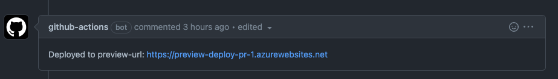

# Azure WebApps Preview Deploy Github Action

A Github action to automate the process of creating a preview deployment of your application on commit to a PR. This replicates the preview deploy feature of Vercel, Netlify and Azure Static WebApps allowing you to deploy an app package to a preview URL when any changes are made to a PR, comment the URL on the PR, and automatically clean up the slot when the PR is closed.



## Features

With this one action you can:

- Create a preview slot on demand and deploy your code
- See the link to that preview automatically posted as a comment and updated when changes are made
- Automatic deletion of the preview on PR closed

## Pre-requisites

To use the action you will need to setup a few things setup in your Azure environment and Github repo. You will need the following:

- A target Azure Web App to create the slots.
- Azure Active Directory (Azure AD) application. There are a number of ways you can do this:
  - [Using the Azure Portal](https://learn.microsoft.com/en-us/azure/active-directory/develop/howto-create-service-principal-portal).
  - [Using the Azure CLI](https://docs.azure.cn/zh-cn/cli/ad/app?view=azure-cli-latest#az-ad-app-create)
  - [Using PowerShell](https://learn.microsoft.com/en-us/azure/active-directory/develop/howto-authenticate-service-principal-powershell)
- An Azure Storage Account and container to upload deployment packages to.
  - [Create a storage account documentation](https://learn.microsoft.com/en-us/azure/storage/common/storage-account-create?tabs=azure-portal)
  - [Create a storage container documentation](https://learn.microsoft.com/en-us/azure/storage/blobs/storage-quickstart-blobs-portal?source=recommendations#create-a-container)
- Assign the required roles to the Azure AD app in order to carry out the preview deploy:
  - Assign the [Contributer](https://learn.microsoft.com/en-us/azure/role-based-access-control/built-in-roles#contributor) role for your Azure Web App.
  - Assign the [Storage Blob Data Contributor role](https://learn.microsoft.com/en-us/azure/role-based-access-control/built-in-roles#storage-blob-data-contributor) to the storage account
- Add the Azure AD the following secrets to your Github repository ([see docs here](https://docs.github.com/en/actions/security-guides/encrypted-secrets#creating-encrypted-secrets-for-a-repository)) and set them to the clientId, clientSecret and tenantId of the AzureAD app you created
  - `AZURE_CLIENT_ID`
  - `AZURE_TENANT_ID`
  - `AZURE_CLIENT_SECRET`

## Using the action

The action requires a set of parameters and requires a specific setup in your github action. You can see an [example workflow here](/.github/workflows/example.yml) but this is explained in more detail below.

### Basic usage

Below is how the action is called in your Github Workflow:

```yml
- uses: sethreidnz/azure-webapps-preview-deploy
  env:
    AZURE_CLIENT_ID: ${{ secrets.AZURE_CLIENT_ID }} # you must set these as environment variables in order to use the Azure SDK tooling
    AZURE_TENANT_ID: ${{ secrets.AZURE_TENANT_ID }}
    AZURE_CLIENT_SECRET: ${{ secrets.AZURE_CLIENT_SECRET }}
  with:
    githubToken: ${{ secrets.GITHUB_TOKEN }} # the action will carry out in the context of your repository and use the github-actions user
    subscriptionId: 'subscriptionId' # the subscription that contains the target WebApp
    resourceGroup: 'resourceGroup' # the resource group that contains the target WebApp
    webAppName: 'webAppName' # the target WebApp name
    storageAccount: 'storageAccount' # the storage account name used for uploading deployment packages
    storageContainer: 'storageContainer' # the storage container used for uploading deployment packages
    deployPackagePath: 'deployPackagePath' # the path to a zipped deployment
```

### Configuration required for automatic cleanup

One of the key features of this action is to cleanup the slot created once a PR is closed or merged. In order to do this you will need to setup your workflow in a particular way because the action is setup to automatically do the following actions based on the pull-request event that triggered it:

- [`opened`,`synchronize`] - This will trigger a deployment to a preview slot based on the pull request id
- [`closed`] - This will delete the preview slot associated with the pull request id

For this reason the simplest way to set it up is as in the [example workflow here](/.github/workflows/example.yml) which is outlined below:

1. Setup the trigger to be based on pull-request and capture all three events:

```yml
name: ExampleProject - Build and preview deploy
on:
  pull_request:
    types: [opened, synchronize, closed]
```

2. Build your application package and add it to the cache in a job that doesn't run on the event 'closed':

```yml
jobs:
  build:
    runs-on: ubuntu-latest
    if: github.event.action != 'closed' # this will mean your build doesn't run again when the PR is closed
```

3. Ensure that you use artifacts or the cache to make the deployment package available to other jobs in the workflow. For example the following will cache the zip file under a key `build-package`:

```yaml
- uses: actions/cache@v2
  id: build-package
  with:
    path: ${{ github.workspace }}/ExampleProject/bin/ExampleProject.zip
    key: ${{ github.sha }}
```

4. Create separate job that depends on the build job but will always run. This will ensure that it runs on all three of the events `opened`, `synchronize` and `closed`.

```yml
preview-deploy:
  needs: [build]
  if: ${{ always() }}
  runs-on: ubuntu-latest
  steps:
    - uses: actions/checkout@v2
    - uses: actions/cache@v2
      id: build-package
      with:
        path: ${{ github.workspace }}/ExampleProject/bin/ExampleProject.zip
        key: ${{ github.sha }}
    - uses: ./
      env:
        AZURE_CLIENT_ID: ${{ secrets.AZURE_CLIENT_ID }}
        AZURE_TENANT_ID: ${{ secrets.AZURE_TENANT_ID }}
        AZURE_CLIENT_SECRET: ${{ secrets.AZURE_CLIENT_SECRET }}
      with:
        githubToken: ${{ secrets.GITHUB_TOKEN }}
        subscriptionId: 'subscriptionId'
        resourceGroup: 'resourceGroup'
        webAppName: 'webAppName'
        storageAccount: 'storageAccount'deployment packages
        storageContainer: 'storageContainer'
        deployPackagePath: 'deployPackagePath'
```

Now when your PR closes it will run this action again and this will automatically delete the slot!

## The future of this action

This project was created during an internal Microsoft Hackathon with the intention of showing the value of bringing this feature into Azure Web Apps itself. If you use this action and find it useful please let me know.

## Contributing

If you have any suggestions on how to make it easier to use or more robust please feed free to open a PR.
